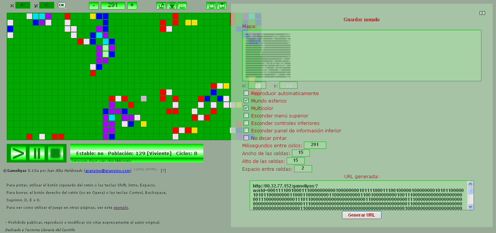

Gamoliyas 
========== 
by Joan Alba Maldonado (joanalbamaldonadoNO_SPAM_PLEASE AT gmail DOT com, without NO_SPAM_PLEASE)

Game of Life totally written in DHTML.

Version: 0.12a 
- Date: 13th August 2007 (approximately).

You can donate at http://sourceforge.net/project/project_donations.php?group_id=203173

## Description

Open source Conway's Game of Life version (highly configurable) totally written in DHTML (HTML, CSS and JavaScript).

It is my ninth DHTML game and was made in mid 2007.

Players can configure the game with many options, as changing the world size, choosing between spherical and limited world, using colours that change depending on the number of neighbours, changing speed, saving a world or opening a previously stored one, drawing cells yourself or generating them randomly, etc.

The game is specially designed to allow to be used inside any other web site (by using an IFRAME, for example). We just need to get the URL (which will be used in the SRC parameter of the IFRAME tag) generated by the "save world" option with the desired behaviour we have decided in the options that the game will ask us (world size, auto-play, spherical world, multicolour, hide top menu, hide bottom controls, hide bottom information panel, do not allow to draw, speed, size of the cells and space between cells). The game accessed through that URL will start containing the cells which were present when we pressed the "save world" option. You can see a live example using this game with an IFRAME in my personal portfolio: http://www.joanalbamaldonado.com/portfolio/

You can also change the game behaviour easily by editing many of the configuration variables which are at the beginning of the script. To change the game images you just need to replace them with others.

This game only uses a few images which are not necessary to make it work if we are using the game with the panels and such hidden. So all the rest you can see has been made using just pure HTML and CSS.

Official languages are Spanish and English.

You can find other modified and adapted versions of this game on the Internet, including one Opera widget.

This game has been tested under BeOS, Linux, NetBSD, OpenBSD, FreeBSD, Windows, Mac OS X, BlackBerry Tablet OS, Android, iOS and others.

Play online in English: http://gamoliyas.tuxfamily.org/gamoliyas_english/

Play online in English (mirror): http://www.dhtmlgames.com/gamoliyas/gamoliyas_english/

Play online in Spanish: http://gamoliyas.tuxfamily.org/gamoliyas_spanish/

Play online in Spanish (mirror): http://www.dhtmlgames.com/gamoliyas/gamoliyas_spanish/

Official web site: http://gamoliyas.tuxfamily.org/ (mirror at http://www.dhtmlgames.com/gamoliyas/).

## License

This project can be used, reproduced, distributed and modified freely for any non-commercial purposes but always keeping the author's name and copyright clauses. Other than that, just use this project as you wish but never sell it!